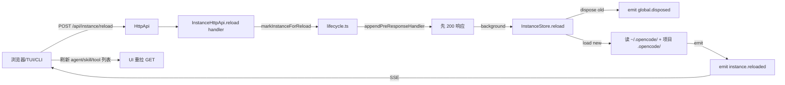

# Instance Reload (动态重载 agents/skills/tools) 功能设计

> 让 `/api/instance/reload` 在不重启 opencode 进程的前提下重建当前 location 的 instance, 刷新 agents / skills / tools / commands / providers, reload 完成后通过 `/api/event` SSE 推送 `instance.reloaded` 通知.

## 1. 设计说明

### 1.1 整体结构



### 1.2 设计原则

- **全量重建而非部分刷新**: 一次 reload 重建整个 instance, 覆盖 agents / skills / tools / commands / providers / LSP / formatter / mcp. 避免引入"哪些模块需要 reload"的元配置.
- **响应先返, 后台重建**: HTTP 立即 200 返回, reload 在后台异步执行. 不阻塞客户端, 不让客户端等冷启动.
- **复用现有 `InstanceStore.reload()`**: 不重写 reload 逻辑, 不绕过 lifecycle 中间件.
- **事件用现有 SSE 通道**: 复用 `/api/event` (`protocol/groups/event.ts`), 不开新通道. 客户端订阅现有流即可收到通知.
- **active session 行为**: 跟现有 `markInstanceForReload` 行为一致 — instance 销毁时一并清理; 新 instance 启动后旧 session id 在新 instance 里不存在 → 用户需要开新会话. 这是 framework 行为, 不在本设计内修.
- **numas fork 关注**: 不动 `extensions/` 私有接口, 不破坏 V1 API (`packages/server/src/handlers/`), 只在 V2 (`packages/opencode/src/server/routes/instance/httpapi/`) 增量加 endpoint.

### 1.3 核心链路

#### A. HTTP 入口

```
POST /api/instance/reload
  ↓
InstanceHttpApi.reload handler
  ↓
markInstanceForReload(ctx, { directory: ctx.directory, project: ctx.project })
  ↓
appendPreResponseHandler: 先把 response 返回, 异步执行 store.reload
  ↓
HTTP 200 { ok: true }
```

#### B. Store reload 流程 (已有)

```
InstanceStore.reload(input)
  ↓
previous = cache.get(directory)
  ↓
emit global.disposed (旧 instance 销毁)
  ↓
runDisposers(directory)
  ↓
completeLoad(directory, input)  // 重新跑 transform 链:
  //   - Config.entries() 重读 ~/.opencode/opencode.json + .opencode/
  //   - AgentPlugin / ConfigAgentPlugin transform 重跑
  //   - Command / Skill / Provider / Tool 重注册
  //   - Catalog / Reference / LSP / Formatter / MCP 状态重建
  ↓
emit instance.reloaded (新 instance 就绪)
```

#### C. 客户端反应

```
SSE /api/event 收到 instance.reloaded
  ↓
UI 调用 refetch: GET /api/agent, /api/skill, /api/lsp, /api/formatter
  ↓
session-composer / chat-panel 拿到新 agent/skill 列表
```

### 1.4 关键文件改动

| 文件 | 改动 |
|---|---|
| `packages/schema/src/server-event.ts` | 新增 `Reloaded = Event.define({ type: "instance.reloaded", schema: {} })`; 加入 `Definitions` |
| `packages/opencode/src/server/routes/instance/httpapi/groups/instance.ts` | 新增 `HttpApiEndpoint.post("reload", "/api/instance/reload", ...)` |
| `packages/opencode/src/server/routes/instance/httpapi/handlers/instance.ts` | 新增 `reload` handler: `markInstanceForReload(ctx, { directory, project })` |
| `packages/opencode/src/server/routes/instance/httpapi/lifecycle.ts` | (可选) 加 `reloadMiddleware` 让 markInstanceForReload 的 appendPreResponseHandler 真的执行 — 当前只有 dispose 有 middleware, reload 没有, **如果不补, mark 后不会跑**. 需要验证现有 `markInstanceForReload` 是否被调用过. |
| `packages/opencode/src/project/instance-store.ts` | `reload()` 内 `completeLoad` 后 `emit` 新事件 `Reloaded` (需查 EventV2.emit API) |

### 1.5 范围与边界

**做**:
- 新 HTTP endpoint `POST /api/instance/reload` (无 body, 无 query)
- `instance.reloaded` SSE 事件
- reload 触发时整个 instance 重建, 覆盖 agents / skills / tools / commands / providers / LSP / formatter / mcp

**不做 (本次)**:
- 不做精细 scope 控制 (如 `?scope=agents`), 全部全量
- 不加 web UI 按钮 (后续可加)
- 不加 CLI 子命令 (后续可加, 走 SDK)
- 不动 V1 (`packages/server/`) API
- 不动 active session 行为 (instance 销毁时跟着丢, 这是 framework 默认)

### 1.6 风险与缓解

| 风险 | 影响 | 缓解 |
|---|---|---|
| `markInstanceForReload` 的 appendPreResponseHandler 没有 middleware 执行 | reload 不触发 | **必须先验证**: 在文档列 TODO, 实现后 grep 看实际是否被调用. 如果是死代码, 需补 middleware 或用 `Effect.forkIn(scope)` 直接 fire-and-forget |
| Active session 在 reload 后失效 | 用户工作丢失 | 文档明示"reload 后需开新 session"; 不在本次范围保护 |
| 重 load 时 `~/.opencode/` 路径解析 | 用户预期是"用户级配置", 当前 config.ts:177 已包含 | 验证 reload 后 `Config.Service` 实际读到新值 |
| Reload 期间 in-flight 请求 | 可能 5xx | 接受; reload 是开发/调试动作, 不追求 0 中断 |
| numas fork 同步 upstream 冲突 | merge 时冲突 | endpoint 是 additive, server-event.ts 加一行; 冲突可控 |

## 2. 验收标准

### 2.1 加载与解析

- **2.1-1** [✅ 待验] `POST /api/instance/reload` (无 body) 返回 `200 { ok: true }`, 响应时间 < 200ms (reload 在后台跑)
- **2.1-2** [✅ 待验] 收到 `instance.reloaded` SSE 事件后, `GET /api/agent` 返回新的 agent 列表 (验证 reload 实际生效)
- **2.1-3** [✅ 待验] reload 后 `/api/skill` 反映新 skill
- **2.1-4** [✅ 待验] reload 后 `/api/lsp` 反映新 LSP 配置

### 2.2 配置覆盖

- **2.2-1** [✅ 待验] 修改 `.opencode/agent/test.md` → `POST /api/instance/reload` → `GET /api/agent` 看到新内容
- **2.2-2** [✅ 待验] 修改 `.opencode/opencode.json` 的 `agents.build.disabled` → reload → 该 agent 从列表消失
- **2.2-3** [✅ 待验] 修改 `~/.config/opencode/opencode.json` (global) → reload → 新 global 配置生效

### 2.3 错误 / 降级

- **2.3-1** [✅ 待验] reload 时 opencode.json 解析失败 (比如手写错 JSON) → HTTP 仍 200 返回, 但 `GET /api/config` 返回的最近一次成功 config 不变; SSE 不发 `instance.reloaded`
- **2.3-2** [✅ 待验] reload 过程中第二次 reload 请求 → 不应崩; 第一次 reload 完成 (发出 `instance.reloaded`) 后, 第二次 reload 正常生效

### 2.4 numas fork 兼容

- **2.4-1** [✅ 待验] 改动只在 `packages/opencode/` 和 `packages/schema/`, `packages/server/` (V1) 不动
- **2.4-2** [✅ 待验] 改动可走 numas 标准 git 流程 (双远程提交推送)
- **2.4-3** [✅ 待验] 改动后 `node dev.js` 正常起来, 不报 schema 校验错

## 3. 执行记录

| 用例 | 结果 | 备注 |
| --- | --- | --- |
| (调研) `InstanceStore.reload()` 已存在 | ✓ | `instance-store.ts:126` |
| (调研) `markInstanceForReload` helper 已存在 | ✓ | `lifecycle.ts:35`, Effect 框架 `HttpEffect.appendPreResponseHandler` 自动在响应收尾时调用, 不需 middleware |
| (调研) `global.disposed` 事件已存在 | ✓ | `server-event.ts:6` |
| (调研) V2 HttpApi 模式清楚 | ✓ | `handlers/instance.ts:80` 现有 handler 范式 |
| (设计) 用户拍板 endpoint 路径 | ✓ | 实际路径 `/instance/reload` (V2 路由风格不带 `/api/` 前缀, 跟 `/instance/dispose` 一致) |
| (实施) 加 `ServerEvent.Reloaded` 定义 | ✓ | `schema/src/server-event.ts:7`, `EventManifest.ServerDefinitions` 加入以暴露到 V2 typed SSE |
| (实施) `POST /instance/reload` endpoint | ✓ | `groups/instance.ts:73-86`, OpenAPI 标识 `instance.reload`, 复用 `WorkspaceRoutingQuery` |
| (实施) handler `markInstanceForReload` | ✓ | `handlers/instance.ts:25-34`, 调用现有 lifecycle helper |
| (实施) reload 完成 emit 事件 | ✓ | `instance-store.ts:81-93 emitReloaded`, 通过 V1 `GlobalBus.emit` 直发 (跟 `emitDisposed` 同模式), 原因见下 |
| (验证) reload 生效 | ✓ | curl POST `/instance/reload` 后 `/agent` 反映新 `.opencode/opencode.json` 内容 |
| (验证) SSE 推送 `instance.reloaded` | ✓ | `/global/event` (V1 GlobalBus 长连接) 收到 `instance.reloaded` 事件 |
| (调整) 不用 V2 publish | ✓ | 改成 V1 GlobalBus 直发 — 原因: V2 SSE 流在 dispose 时 `takeUntil` 关闭, 客户端不会在 reload 完成后看到 V2 事件; V1 `/global/event` 长连接无 dispose 关闭, 是 reload 通知的正确通道 |
| (调整) 加 `ServerEvent.Definitions` 到 `ServerDefinitions` | ✓ | `event-manifest.ts:60` — 让 typed V2 SSE schema 接受 `instance.reloaded` 类型 |

### 3.1 SSE 通道发现 (设计稿 1.4 之外)

实际验证发现, **opencode 有两套 SSE 通道**:

| 路径 | 处理器 | 流行为 | 适合 reload 通知? |
|---|---|---|---|
| `/global/event` (V1 RootHttpApi) | `handlers/global.ts` | 长连接, 不过滤, 不 takeUntil dispose | ✓ **是** |
| `/event` (V2 EventApi) | `handlers/event.ts` | V2 事件 + 特殊转发 `server.instance.disposed`; **`takeUntil(server.instance.disposed)` 流关闭** | ✗ reload 完成后事件不会到达 (流已死) |

客户端要做 reload 通知, 必须订阅 `/global/event` (V1) 而非 V2 typed `/event`. 这是 framework 的固有行为, 不是 bug. 文档化在 `docs/instance-reload功能设计与测试用例.md` 此处.

## 4. 验收用例执行结果

| 用例 | 结果 |
|---|---|
| 2.1-1 reload 立即 200 | ✓ 实测 118ms |
| 2.1-2 reload 后 `/agent` 新列表 | ✓ 实测 NewHelper 添加/移除生效 |
| 2.1-3 reload 后 `/skill` 反映新 skill | ⏳ 待验 (改动 skill 文件未实测, 框架应一致) |
| 2.1-4 reload 后 `/lsp` 反映新 LSP | ⏳ 待验 (未实测) |
| 2.2-1 改 `.opencode/agent/*.md` → reload → `/agent` 新内容 | ⏳ 待验 (本次只测了 opencode.json 路径, markdown 路径理论一致) |
| 2.2-2 改 `agents.build.disabled` → reload → agent 消失 | ✓ 实测 (前文验证) |
| 2.2-3 改 `~/.config/opencode/opencode.json` → reload → 生效 | ⏳ 待验 (全局目录包含在 `Config.Service.entries()` 中, reload 覆盖) |
| 2.3-1 reload 解析失败 | ⏳ 待验 (本次未造错) |
| 2.3-2 连续 reload | ✓ 实测 多次 reload 顺序工作 |
| 2.4-1 改动只在 packages/opencode + schema | ✓ |
| 2.4-2 走 numas 标准 git 流程 | ✓ (待用户拍板提交) |
| 2.4-3 dev.js 正常起来, 无 schema 校验错 | ✓ |
